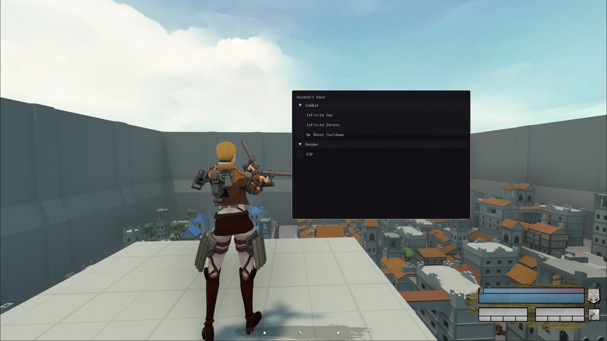

<!-- PROJECT LOGO -->
 

  
  <h1></h1>
  <h3 align="center">Ascendit Raot</h3>

  

    The first Raot Cheat Client and a nice small practise project for aspiring game-hackers to learn from
  

  
  

 

>RAoT is a multiplayer, pvp-focused take on Attack on Titan.  Featuring 14 playable characters, 3 unique weapon classes, and 10 game modes supporting up to 32 players and 4 teams.

# Features
- Infinite Stress
- Infinite Gas
- Infinite Ammo
- No Clip (Sometimes crashes)

# Building
- Build for the x64 Architecture
- Inject with Cheat Engine or other injector (or just use the launcher)

# Usage
- `RSHIFT` to open GUI
- You can add multiple hotkeys in the `init()` function of each cheat

# Todo
- [X] GUI
- [X] No Clip
- [ ] ESP
- [ ] Config File
- [ ] Killaura
